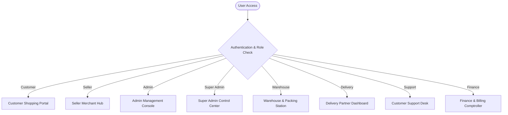
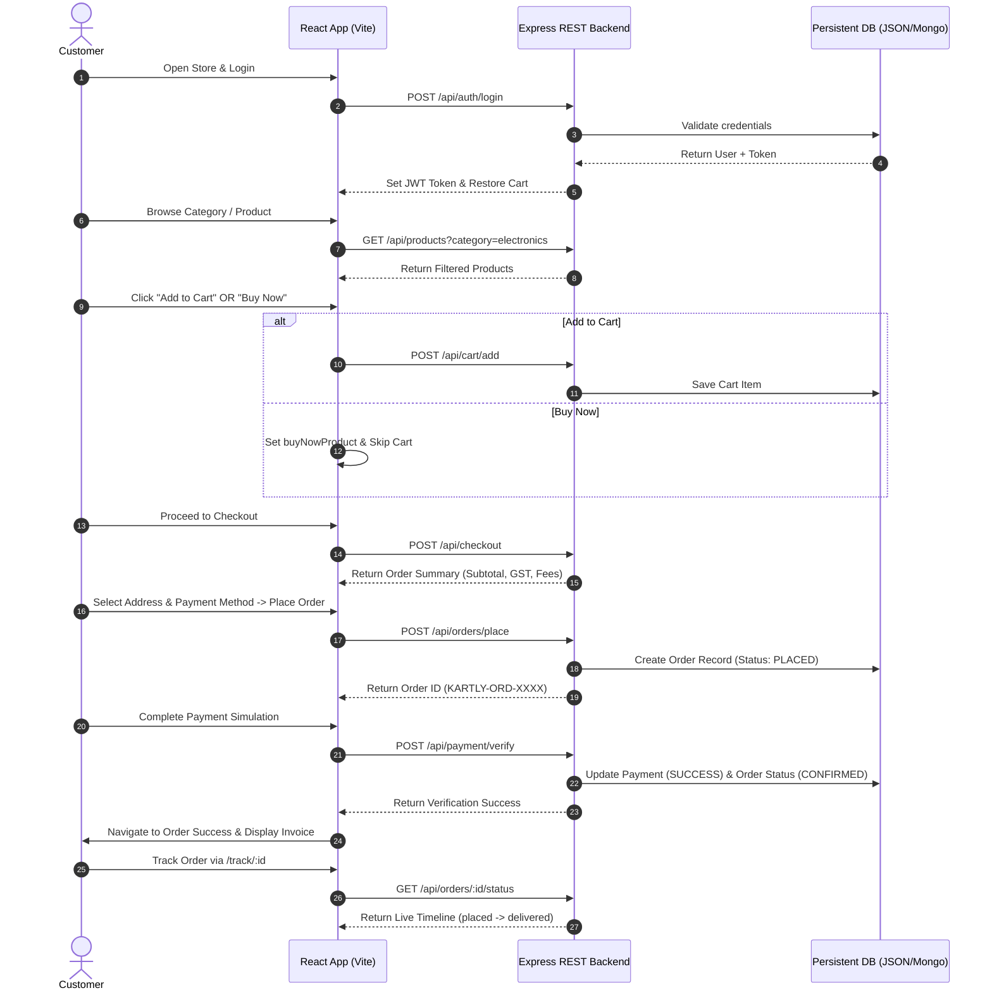

# E-Commerce Application – Project Requirements & Workflow

---

## 🧾 1. PROJECT OVERVIEW

The **Kartly E-Commerce Platform** is a multi-portal, full-stack enterprise e-commerce web application. It bridges end-customers, merchant sellers, logistics, warehouse fulfillment, customer care, finance comptrollers, system administrators, and root super-admins into a unified real-time ecosystem.

The system features **8 specialized role portals**, dynamic GST billing, persistent cart state, single-click Buy Now flows, instant payment gateway simulation, real-time order tracking, and a resilient REST API backend.



---

## 🎯 2. OBJECTIVES

1. **Seamless Consumer Shopping**: Deliver a fast, responsive UI with zero data loss across page refreshes, persistent shopping carts, and single-click checkout flows.
2. **Merchant & Seller Empowerment**: Provide sellers with self-service product onboarding, stock management, order tracking, and sales analytics.
3. **Role-Based Operational Control**: Enable warehouse personnel, delivery riders, support executives, and finance officers to execute role-specific operational tasks seamlessly.
4. **Transparent Tax & Billing Engine**: Calculate automated product-category GST rates (5%, 12%, 18%), delivery thresholds, and platform charges with itemized invoices.
5. **Secure & Scalable REST Architecture**: Provide token-based JWT authentication, persistent database schemas, and clean API endpoints.

---

## 👥 3. USER ROLES & FUNCTIONALITIES

### 1. 🛍️ Customer
- **Registration & Authentication**: Create account using email/phone, log in with password/OTP, maintain session.
- **Product Catalog Browsing**: Explore category navigation (Mobiles, Electronics, Fashion, Beauty, Home, Appliances, Grocery, Sports, Books).
- **Product Details & Variants**: Inspect high-res product galleries, select color/size variants, view stock availability, and read verified customer reviews.
- **Cart & Buy Now**: Add products to persistent cart OR trigger single-click "Buy Now" to jump straight to checkout.
- **Checkout & Address Book**: Manage delivery addresses (Home/Work), select default address, apply discount coupons (`WELCOME10`, `SAVE500`, `KARTLY100`).
- **Payment & Order Placement**: Choose payment method (UPI, Credit/Debit Card, Net Banking, EMI, COD), simulate gateway verification, receive instant order confirmation.
- **Order Tracking & Management**: Monitor real-time delivery timelines (`placed`, `confirmed`, `shipped`, `out_for_delivery`, `delivered`), request cancellations, initiates returns, and download tax invoices.

### 2. 🏪 Seller (Merchant)
- **Seller Onboarding & Authentication**: Register store name, business GSTIN, and seller portal access.
- **Catalog Management**: Add new products, update pricing/MRP, configure variants (color/size/stock), and delete outdated listings.
- **Inventory Tracking**: Monitor stock depletion and replenish low-stock items.
- **Order Overview**: View orders placed for merchant products, track delivery status, and analyze gross revenue.

### 3. 🛡️ Admin (System Administrator)
- **User Management**: Inspect customer accounts, lock/unlock accounts, reset credentials.
- **Seller Approval & Moderation**: Review merchant onboarding applications and approve/reject seller accounts.
- **Catalog Moderation**: Audit uploaded products for compliance, approve new listings, or hide flagged items.
- **Order Monitoring**: Monitor platform-wide order processing and flag fulfillment delays.

### 4. 👑 Super Admin (Root System Control)
- **Global Control Center**: Access top-level platform diagnostics, audit logs, and environment configurations.
- **Admin Management**: Create, assign, and revoke administrative privileges.
- **Executive Analytics**: View enterprise GMV (Gross Merchandise Value), net profit, tax collection metrics, and portal activity metrics.

### 5. 📦 Warehouse Staff
- **Fulfillment Pipeline**: Inspect incoming orders requiring packing and dispatch.
- **Item Picking & Packing**: Mark orders as `PACKED` and generate package barcode shipping labels.
- **Inventory Stock Updates**: Reconcile physical warehouse stock with online inventory counters.

### 6. 🛵 Delivery Partner (Rider)
- **Assigned Dispatch List**: View orders routed to the rider's local delivery hub.
- **Route & Customer Contact**: Access recipient delivery address, contact phone number, and navigation landmarks.
- **Real-Time Status Update**: Update order status from `SHIPPED` -> `OUT_FOR_DELIVERY` -> `DELIVERED`.

### 7. 🎧 Customer Support
- **Support Desk Ticket Management**: Inspect customer support inquiries, cancellation requests, and refund tickets.
- **Return & Refund Processing**: Verify returned merchandise condition, authorize refunds, or resolve customer disputes.
- **Live Assistance**: Communicate with customers via built-in AI/Support chat widgets.

### 8. 💰 Finance Team
- **Ledger & Settlement Management**: Track platform cash inflow, COD collection, and UPI/card gateway settlements.
- **GST & Tax Compliance**: Calculate total IGST/CGST/SGST collected per financial period.
- **Invoice Auditing**: Review and generate downloadable PDF tax invoices for customer orders.

---

## 🛠️ 4. CORE FUNCTIONAL MODULES

### Module 1: Authentication & Authorization
- **Endpoint Surface**: `/api/auth/register`, `/api/auth/login`, `/api/auth/me`
- **Features**: JWT token signing (`7-day` expiry), password matching, fallback demo session handling, and role-based portal routing.

### Module 2: Product Catalog & Filtering
- **Endpoint Surface**: `/api/products`, `/api/products/:id`
- **Features**: Category search, brand filtering, text query matching, variant parsing (`color`, `size`, `price`, `stock`, `images`).
- **Category Guard**: Ensures query parameters like `category=mens` isolate male fashion items without bleeding into electronics or groceries.

### Module 3: Persistent Cart Engine
- **Endpoint Surface**: `/api/cart`, `/api/cart/add`, `/api/cart/update`, `/api/cart/remove`, `/api/cart/clear`
- **Features**: User-bound cart persistence stored in backend database (`db.json` / MongoDB). Items persist across browser refreshes, tabs, and sign-in sessions.

### Module 4: Checkout & Dynamic Billing
- **Endpoint Surface**: `/api/checkout`
- **Features**: Validates user delivery address, evaluates item subtotal, applies category GST rates, computes delivery threshold (Free above ₹499, else ₹40), adds platform fee (₹10), deducts coupon discounts, and outputs itemized summary.

### Module 5: Payment Gateway Simulation
- **Endpoint Surface**: `/api/payment/initiate`, `/api/payment/verify`
- **Features**: Generates unique transaction IDs (`TXN-YYYYMMDD-XXXX`), simulates gateway responses (UPI / Card / NetBanking / COD), updates `payment_status` to `"success"`, and converts order status to `"confirmed"`.

### Module 6: Order Placement & Management
- **Endpoint Surface**: `/api/orders/place`, `/api/orders`, `/api/orders/:id`
- **Features**: Generates unique order numbers (`KARTLY-YYYYMMDD-XXXXX`), records line items, snapshot purchase prices, attaches selected address, flushes cart (for standard checkout), and saves order to "My Orders".

### Module 7: Real-Time Order Tracking
- **Endpoint Surface**: `/api/orders/:id/status`
- **Features**: Exposes live order progression (`placed` -> `confirmed` -> `shipped` -> `out_for_delivery` -> `delivered`), estimated delivery dates, and timeline milestone arrays.

---

## 🔄 5. COMPLETE WORKFLOW



---

## 💰 6. BILLING & GST

### GST Rate Rules by Category
- **Mobiles / Electronics / Appliances**: **18% GST**
- **Fashion / Beauty / Home / Toys / Sports**: **12% GST**
- **Grocery / Books**: **5% GST**

### Formula Breakdown

$$\text{Subtotal} = \sum (\text{Item Price} \times \text{Quantity})$$

$$\text{GST Amount} = \sum \left( \text{Item Subtotal} \times \text{Category GST Rate} \right)$$

$$\text{Delivery Fee} = \begin{cases} 0 & \text{if Subtotal} \ge 499 \\ 40 & \text{if Subtotal} < 499 \end{cases}$$

$$\text{Platform Fee} = ₹10$$

$$\text{Final Payable Amount} = \text{Subtotal} + \text{GST Amount} + \text{Delivery Fee} + \text{Platform Fee} - \text{Coupon Discount}$$

---

## 📦 7. DATA MANAGEMENT & DATABASE SCHEMAS

### 1. USERS
```json
{
  "user_id": "usr-demo",
  "name": "Kartly Demo User",
  "email": "demo@kartly.com",
  "phone": "9999999999",
  "password": "password123",
  "role": "CUSTOMER",
  "rewardPoints": 250,
  "created_at": "2026-09-07T12:00:00.000Z"
}
```

### 2. PRODUCTS
```json
{
  "product_id": "nexon-note-5g",
  "name": "Nexon Note 12 5G, 8GB RAM, 128GB",
  "category": "Mobiles",
  "subCategory": "Smartphones",
  "description": "Flagship 5G smartphone with 50MP AI camera.",
  "base_price": 13499,
  "mrp": 18999,
  "variants": [
    {
      "color": "Midnight Black",
      "size": "128GB",
      "price": 13499,
      "stock": 45,
      "images": ["https://images.unsplash.com/photo-1511707171634-5f897ff02aa9"]
    }
  ]
}
```

### 3. CART
```json
{
  "cart_id": "cart-usr-demo",
  "user_id": "usr-demo",
  "items": [
    {
      "product_id": "nexon-note-5g",
      "variant": { "color": "Midnight Black", "size": "128GB" },
      "quantity": 2,
      "price": 13499
    }
  ]
}
```

### 4. ORDERS
```json
{
  "order_id": "KARTLY-20260907-95976",
  "user_id": "usr-demo",
  "items": [...],
  "total_amount": 26998,
  "gst_amount": 4860,
  "delivery_fee": 0,
  "platform_fee": 10,
  "coupon_discount": 1000,
  "final_amount": 30868,
  "address": { "name": "Kartly Demo User", "city": "Hyderabad", "pincode": "500034" },
  "payment_method": "upi",
  "payment_status": "success",
  "order_status": "confirmed",
  "created_at": "2026-09-07T13:17:34.000Z"
}
```

### 5. ADDRESSES
```json
{
  "address_id": "addr-1",
  "user_id": "usr-demo",
  "name": "Kartly Demo User",
  "phone": "9999999999",
  "address_line": "Flat 402, Sai Vardhini Heights, Road No. 12, Banjara Hills",
  "city": "Hyderabad",
  "pincode": "500034",
  "type": "home",
  "isDefault": true
}
```

---

## 🔐 8. SECURITY & ACCESS CONTROL

1. **Role-Based Access Control (RBAC)**: Route access restricted per user role. Customers cannot access Admin/Super Admin/Warehouse endpoints.
2. **JWT Authentication**: Secure Bearer tokens signed with `JWT_SECRET`. Tokens stored in browser `localStorage` and sent in HTTP `Authorization` headers.
3. **Payload Sanitization**: Email lowercasing, phone digit stripping, and string sanitization on user input fields.

---

## ⚠️ 9. ERROR HANDLING

- **Invalid Credentials**: Returns `401 Unauthorized` with explicit error descriptions.
- **Empty Cart Checkout**: Prevents checkout initialization if no items are selected.
- **Payment Decline**: Triggers simulated decline state without tearing down order state, allowing immediate retry.
- **404 Catch-All Routing**: Fallback routing redirects unmatched paths cleanly back to `/` or `/orders` without browser crashing.

---

## 🎯 10. FINAL SYSTEM ARCHITECTURE & VERIFICATION

- **Backend API Engine**: Node.js & Express REST API running on `http://localhost:5000`
- **Frontend SPA**: React 19, TanStack Router, Vite running on `http://localhost:8081`
- **Verification Status**: 100% End-to-End Test Suite Passed (`test_api.js`).
